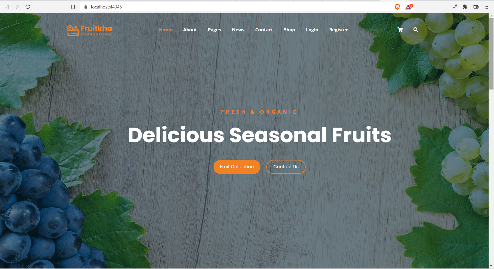

# Fruitika
Ecommerce using MVC Core
--
This is a full stack C# ASP.NET e-commerce store that sells Fruits!

**Authors**: Sara Elhawary <br />
**Version**: 1.0.0

---
## Overview
This project is a full stack web application that serves as an e-commerce website 
selling fruits. 

### Registeration and Login
User can add items to cart as an anonymous user before login, which will be stored in local storage and then moved to database upon registeration and login.

#### Shopping
From here, users are able to browse the store, and add whichever item they would like 
to their cart. They are able to add quantities of the item or remove an item form 
their cart.

#### Checkout
After shopping, a user will be asked for their shipping information.  This will be 
stored in our database.  Users can have multiple orders.  


#### Payment
Customers can pay with a fake credit card number upon checkout.  


---
## Getting Started
The following is required to run the program.
1. Visual Studio 2017 Community or Enterprise edition or later versions.
2. ASP.NET NuGet packages
  . Microsoft.AspNetCore.Identity.EntityFrameworkCore (5.0.15)
  . Microsoft.AspNetCore.Mvc.Razor.RuntimeCompilation (5.0.15)
  . Microsoft.EntityFrameworkCore.SqlServer (5.0.15)
  . Microsoft.EntityFrameworkCore.Tools (5.0.15)
  . Microsoft.VistualStudio.Web.CodeGeneration.Design (5.0.2)
  . Microsoft.EntityFrameworkCore.Design (5.0.15)

## Build
To run this locally, install the [.NET SDK package](https://www.microsoft.com/net/download/dotnet-core/5).
Clone this repo through a bash terminal and type the following commands:
```
cd Fruitika
dotnet restore
dotnet bulid
dotnet run
```

---
## Architecture
This application is created using ASP.NET MVC Core 5 Web Application <br />
*Languages*: C#, HTML, CSS, SCSS <br />
*Tools*:  Visual Studio Team Services, SQL Database, Bootstrap <br />
*Type of Application*: Web Application <br />

---



